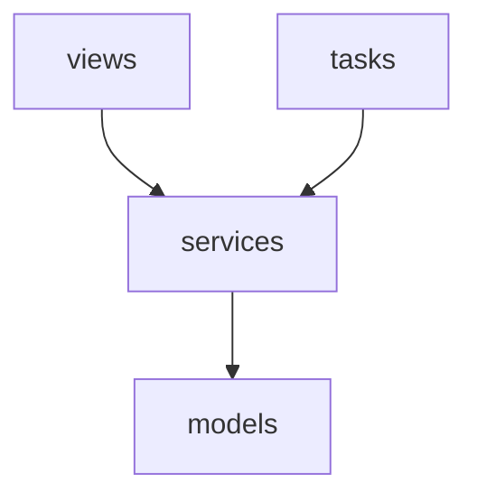
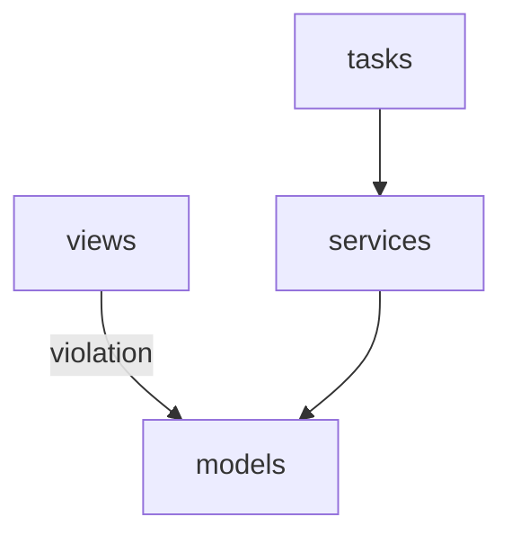

# Mermaid Diagrams in Deply

Deply can generate Mermaid diagrams to visualize your project's layer dependencies. This feature helps you understand the relationships between different layers in your architecture.

## Generating Diagrams

To generate a Mermaid diagram, use the `--mermaid` flag with the analyze command:

```bash
deply analyze --mermaid
```

## Diagram Elements

The generated Mermaid diagram includes the following elements:

- **Nodes**: Represent your project's layers
- **Edges**: Show dependencies between layers
- **Violations**: Highlighted in red to indicate architectural violations

## Example Diagrams

### Basic Layer Dependencies



### With Violations



## Interpreting Diagrams

- **Normal Dependencies**: Shown as regular arrows
- **Violations**: Shown as red arrows with "violation" label
- **Layer Names**: Shown in square brackets
- **Direction**: Arrows point from dependent layer to dependency

## Best Practices

1. Use diagrams to validate your architectural decisions
2. Look for unexpected dependencies
3. Identify potential architectural improvements
4. Share diagrams with team members for discussion
5. Update diagrams regularly as your project evolves

## Integration

The Mermaid diagrams can be:
- Viewed directly in the terminal
- Exported to other tools that support Mermaid
- Used in documentation
- Shared with team members

For more information about using Deply's analysis features, please refer to the [Command Line Interface](cli.md) documentation. 